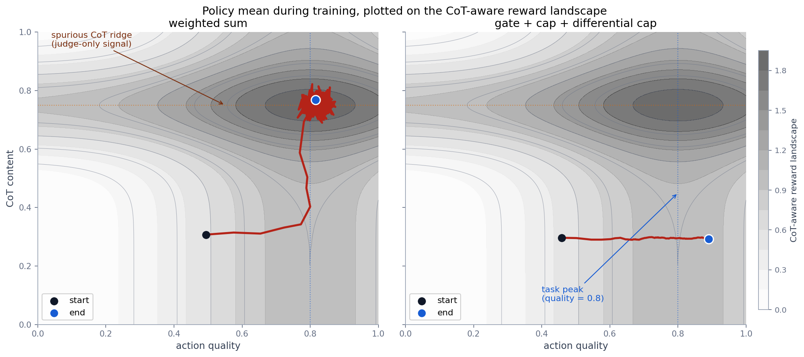
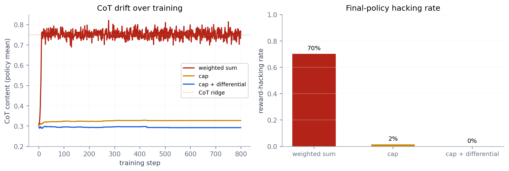

# rewardcap

A small library for composing reward signals in LLM post-training, so that no individual scorer — and in particular no chain-of-thought-reading scorer — can dominate the policy update.

The idea is one line: replace the weighted sum

```
R(x) = w₁·correctness(x) + w₂·format(x) + w₃·llm_judge(x) + …
```

with a structured composition

```
R(x) = [all gates pass] · Σ min(c_s, s(x))
```

where every CoT-reading scorer `s_aware` is paired with a CoT-blind companion `s_blind` and clipped by a per-sample budget `δ`:

```
s̃(x) = min(c_s,  s_blind(x) + clip(s_aware(x) - s_blind(x), -δ, δ))
```

`δ = 0` collapses to the blind reward. `δ → ∞` recovers the unclipped CoT-aware reward. The interesting region is the small positive values in between.

## Why

If you're combining a correctness checker, a format check, and an LLM judge into a single reward, the weighted sum gives every scorer a direct path into the policy gradient. Two things go wrong in practice:

- Format compliance becomes a local maximum and crowds out correctness, the way it did in [Med-RLVR](https://arxiv.org/abs/2502.19655).
- If the judge can see the chain of thought, gradient descent will amplify whatever CoT pattern happens to correlate with high judge scores, even when the pattern is unrelated to task quality. This is the dynamic [Baker et al.](https://arxiv.org/abs/2503.11926) call obfuscated reward hacking.

Both are weighting failures *only* in the sense that the composition function has no structural mechanism to prevent them. `rewardcap` provides that mechanism. Prerequisites are gates, not bonuses. Each scorer has a hard per-sample cap. CoT-reading scorers come with a CoT-blind companion and a clipped residual.

## What it actually does



The toy is two-dimensional: actions live in `[0,1]²`, with axes `action_quality` and `cot_content`. The task reward depends only on `action_quality` and peaks at 0.8. A CoT-aware "judge" likes high quality, but it *also* assigns a sharp +0.9 bonus near `cot_content = 0.75` — a feature that has nothing to do with task quality but is visible in the chain of thought. The gradient of that bonus is much steeper than the gradient of the quality term, so under a naive weighted sum the policy walks straight up the ridge.

The left panel shows what that looks like: the policy ends sitting on the spurious CoT ridge, with `action_quality` only at 0.82. The right panel uses the structured composition; the policy ignores the ridge and reaches `action_quality = 0.89`.

The hacking rate (fraction of samples where the aware judge scores high but the blind checker disagrees) and CoT drift across the schemes that actually differ:



In this toy, the gate is satisfied everywhere by construction, so "gate only" is indistinguishable from the weighted sum, and "gate + cap" is indistinguishable from "cap only". The cap is what kills the CoT drift; the differential cap adds a small extra improvement and brings the hacking rate to zero.

| scheme | quality end | CoT end | hacking rate | task reward |
| :-- | --: | --: | --: | --: |
| weighted sum | 0.82 | 0.77 | 70% | 0.91 |
| cap | 0.86 | 0.33 | 2% | 0.90 |
| cap + differential (δ=0.05) | 0.89 | 0.29 | 0% | 0.88 |

Numbers are deterministic at `SEED=0`. The full five-way ablation including gate-only and gate+cap is in `results/ablations.csv`.

## Use it

```python
from src.composition import (
    CompositionSpec, Gate, Scorer, DifferentialCap, Compositor,
)
from src.audit import assert_audit_passes

spec = CompositionSpec(
    gates=[Gate("format", predicate=is_well_formed, threshold=0.5)],
    scorers=[
        Scorer("correctness", fn=exact_match, cap=0.5),
        DifferentialCap(
            name="judge",
            fn_aware=judge_with_cot,
            fn_blind=judge_answer_only,
            cap=0.3,
            delta=0.05,
        ),
    ],
    gate_penalty=-2.0,
)

assert_audit_passes(spec)        # call in tests; fails CI on a bad config
reward = Compositor(spec).compose(model_output).reward
```

`audit(spec)` checks three things statically before training starts:

1. Every CoT-reading scorer is wrapped in a `DifferentialCap`.
2. At least one gate is present.
3. `Σ c_s ≤ k · |gate_penalty|` for some `k < 1` (default 0.5). Without this, a sufficiently determined optimizer can pay the gate penalty in exchange for saturating every scorer.

Rule 3 is a design rule, not a theorem. The KL bound in [`docs/theory.md`](docs/theory.md) that motivates the per-scorer cap is a sizing heuristic: second-order Fisher approximation, independent per-scorer KL, no off-policy corrections. It tells you what order of magnitude to pick `c_s` at, not what value.

## Reproduce

```bash
pip install -r requirements-dev.txt
make repro       # runs the 45 tests, executes 4 notebooks, writes figures
```

The figures embedded above are generated by `scripts/make_figures.py`. The five-scheme grid and the open-r1-style audit example live in `notebooks/02_structured_composition.ipynb` and `notebooks/03_audit.ipynb`.

## What's not in this repo

A real training run. The 2D toy is deliberately a toy — composition dynamics in a GRPO loop involve off-policy corrections, KL regularization, and entropy bonuses the bound doesn't see. The scaffold at [`experiments/qwen_gsm8k/`](experiments/qwen_gsm8k/) wires the same composition into TRL's `GRPOTrainer` on Qwen 2.5-1.5B + GSM8K with a `--composition {weighted_sum, rewardcap}` switch, but it uses a stubbed judge and isn't executed by `make repro`. There are no claimed training numbers.

The differential cap also needs a CoT-blind companion for every CoT-reading scorer. For LLM judges that's straightforward (re-run on the parsed answer). For open-ended rewards without a natural blind companion — helpfulness, style — the formulation doesn't apply yet.

## References

- Baker et al., 2025. [Monitoring Reasoning Models for Misbehavior and the Risks of Promoting Obfuscation](https://arxiv.org/abs/2503.11926).
- Zhang et al., 2025. [Med-RLVR](https://arxiv.org/abs/2502.19655).
- Dalal et al., 2018. [Safe Exploration in Continuous Action Spaces](https://arxiv.org/abs/1801.08757) — the safety-layer paper this borrows the projection framing from.
- Carroll et al., 2026. [Investigating the consequences of accidentally grading CoT during RL](https://alignment.openai.com/accidental-cot-grading/).

Apache 2.0.
