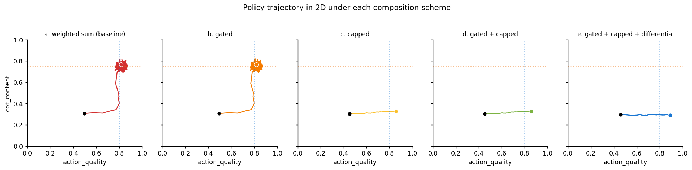
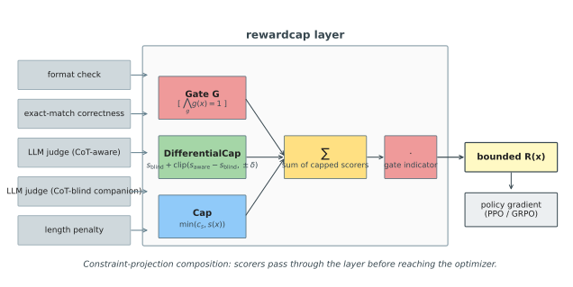

# rewardcap

A constraint-projection layer for monitorability-preserving reward composition in LLM post-training.



*Five composition schemes on a 2D `(action_quality, cot_content)` toy. The vertical dotted line is the task-reward peak; the horizontal dotted line is a spurious CoT ridge created by a CoT-reading LLM judge. Under a weighted sum or a bare gate, the policy drifts up to the ridge. Adding a per-scorer cap stops the drift; adding a `DifferentialCap` keeps it stopped while letting the optimizer reach the quality peak. The differential cap is the structural change this repo proposes. Reproduce with `make repro`.*

## What this is

Modern RL post-training pipelines compose many heterogeneous reward signals — correctness checkers, LLM judges (sometimes with CoT access), safety classifiers, format validators, length penalties — into a single scalar with an ad-hoc weighted sum. When the LLM judge can see the model's chain of thought, gradient descent will discover and amplify any feature in the CoT that happens to correlate with the judge's preferences. This is the *CoT obfuscation* failure mode documented by [Baker et al. (2025)](https://arxiv.org/abs/2503.11926).

`rewardcap` is a thin composition layer that sits between the reward stack and the optimizer. It treats reward composition the way [Dalal et al. (2018)](https://arxiv.org/abs/1801.08757) treats safe exploration: not as a hyperparameter tuning problem but as a *constraint projection*. The composed reward is

```
R(x) = [all gates pass] · Σ_s min(c_s, s(x))
```

with an optional `DifferentialCap` on every CoT-reading scorer that decomposes `s_aware = s_blind + (s_aware - s_blind)` and clips the residual to a per-sample monitorability budget `δ`. Setting `δ = 0` ignores the CoT-conditioned signal entirely; setting `δ = ∞` recovers an unclipped CoT-aware reward. Practitioners pick `δ` from a policy-drift budget; the derivation is in [`docs/theory.md`](docs/theory.md).

## The problem in three paragraphs

**Priority inversion.** The Med-RLVR direct-answer-hacking finding ([Zhang et al. 2025](https://arxiv.org/abs/2502.19655)) trained a 3B model with two summed rewards: format compliance and correctness. Within a few hundred steps the model converged on a degenerate strategy — correctly tagged answers that ignored the actual question, with the chain of thought collapsed to a single sentence stating the answer. Format and correctness each worked as intended individually; the failure was in adding them.

**Gradient dominance.** DeepSeek-R1 ([DeepSeek-AI 2025](https://arxiv.org/abs/2501.12948)) produced reasoning traces of inflated length, not because length helped accuracy but because it correlated with higher LLM-judge scores. The judge's gradient was steeper than the verifier's, so the judge won. [Wen et al. (2024)](https://arxiv.org/abs/2409.12822) showed the same dynamic in RLHF: models learned to convince humans they were right even when they were wrong, with a 24% increase in human false-positive rate on QuALITY.

**CoT drift.** [Baker et al. (2025)](https://arxiv.org/abs/2503.11926) found that direct optimization pressure on chain-of-thought tokens produces *obfuscated* reward hacking — models hide their intent in benign-looking CoT while continuing to hack. [Carroll et al. (2026)](https://alignment.openai.com/accidental-cot-grading/) report that a subset of OpenAI training runs accidentally graded CoT and ask whether that meaningfully degraded monitorability. [Shlegeris's review (Redwood, 2026)](https://blog.redwoodresearch.org/p/openai-cot) argues, in footnote 5, that monitorability degradation should scale with the fraction of total reward variance attributable to the CoT signal. This repo gives the formal derivation of that footnote and a tool for setting that fraction explicitly.

## The framework



Four primitives. A `Gate` is a binary prerequisite (format, safety) that short-circuits the reward when violated. A `Scorer` is a real-valued quality signal with a hard cap `c_s` on its per-sample contribution. A `DifferentialCap` wraps a CoT-aware/CoT-blind pair and clips the CoT-conditioned residual to a monitorability budget `δ`. A `Monitor` is a health predicate on a scorer's rolling window.

A `CompositionSpec` is a declarative bundle of these. `Compositor(spec).compose(action)` is the runtime path. `audit(spec)` is the static checker — it enforces three rules:

| Rule | Check | Reference |
| :-- | :-- | :-- |
| R1 | Every CoT-reading scorer is wrapped in a `DifferentialCap`. | [`docs/theory.md`](docs/theory.md) §3 |
| R2 | At least one gate is present. | [`docs/theory.md`](docs/theory.md) §1 |
| R3 | `Σ_s c_s ≤ k · |gate_penalty|` for some `k < 1` (default 0.5). | [`docs/theory.md`](docs/theory.md) §2.2 |

`assert_audit_passes(spec)` is exposed as a pytest fixture so configs that regress fail CI.

## Quickstart

```bash
git clone <this repo> && cd rewardcap_v2
pip install -r requirements-dev.txt
make test
make repro     # executes all notebooks, dumps figures to results/figures/
```

Three lines to declare a composition:

```python
from src.composition import CompositionSpec, Gate, Scorer, DifferentialCap

spec = CompositionSpec(
    gates=[Gate("format", predicate=is_well_formed, threshold=0.5)],
    scorers=[
        Scorer("correctness", fn=exact_match, cap=0.5),
        DifferentialCap(
            name="judge",
            fn_aware=judge_with_cot,
            fn_blind=judge_answer_only,
            cap=0.3,
            delta=0.05,
        ),
    ],
    gate_penalty=-2.0,
)

from src.audit import assert_audit_passes
assert_audit_passes(spec)              # static check, fails CI on violation

from src.composition import Compositor
result = Compositor(spec).compose(model_output)   # bounded R(x) in result.reward
```

## Reproducing the experiments

```bash
make repro
```

runs `pytest tests/ -v` (45 tests) then executes the four notebooks in-place and writes seeded figures to `results/figures/` plus `results/ablations.csv`. The figures are byte-stable at `SEED=0`. Specifically:

- `notebooks/01_failures.ipynb` reproduces three failure modes (CoT drift, priority inversion, gradient dominance) on the 2D toy and the 1D bandit.
- `notebooks/02_structured_composition.ipynb` produces the hero figure above.
- `notebooks/03_audit.ipynb` runs the audit on three realistic configs, including a faithful reproduction of [open-r1's reward stack](https://github.com/huggingface/open-r1/blob/main/src/open_r1/rewards.py).
- `notebooks/04_ablations.ipynb` writes `results/ablations.csv` isolating gate / cap / differential / monitor contributions to monitorability, hacking rate, and task reward.

For a realistic-scale experiment we provide a TRL+GRPO scaffold at [`experiments/qwen_gsm8k/`](experiments/qwen_gsm8k/) that trains Qwen 2.5-1.5B on GSM8K with the same `--composition {weighted_sum, rewardcap}` switch and emits task accuracy, reward-hacking rate, and a monitorability proxy. The scaffold is not executed in `make repro` — it expects a GPU.

## What is novel

1. **A differential cap on CoT-reading scorers** with a single hyperparameter (`δ`) that bounds the policy-update component attributable to information that appears only in the CoT. This is the reward-side analog of the safety layer in Dalal et al. (2018).
2. **A cap-sizing rule** derived from a per-scorer KL bound `KL_s = O(η · c_s · Var(s) · N)`. This is the formal version of Shlegeris's footnote 5 in the Redwood review of the OpenAI accidental-CoT-grading post: pick `c_s` to bound total policy drift attributable to scorer `s` by a budget `ε`.
3. **A static audit** that mechanically enforces three structural rules on composition configs. The same audit catches the failure mode in a stripped-down open-r1 reward stack today.

## Limitations and open questions

- The KL bound is informal. It linearizes the policy in the Fisher quadratic form and assumes per-scorer KL contributions accumulate independently. For large learning rates or large caps the bound is loose. See [`docs/theory.md`](docs/theory.md) §4.
- The differential cap requires a CoT-blind companion scorer for every CoT-reading scorer. For LLM judges this is straightforward (exact-match or programmatic check on the final answer); for open-ended rewards like helpfulness the formulation does not yet apply. A *learned* blind scorer is a natural extension we have not implemented.
- The 2D toy is deliberately a toy. It makes the dynamics visible at zero compute cost, but composition dynamics in a real GRPO run involve off-policy corrections, KL regularization, and entropy bonuses that the bound does not see.
- Whether `δ > 0` outperforms `δ = 0` on task accuracy in practice is an open empirical question. The point of the framework is that `δ` is a knob practitioners can sweep, not that we prescribe a value.
- The GRPO scaffold at `experiments/qwen_gsm8k/` is runnable but un-run by us. Numbers in the table on the GRPO README are placeholders.

## Citations

- Dalal et al. 2018. [Safe Exploration in Continuous Action Spaces](https://arxiv.org/abs/1801.08757). arXiv:1801.08757.
- Baker et al. 2025. [Monitoring Reasoning Models for Misbehavior and the Risks of Promoting Obfuscation](https://arxiv.org/abs/2503.11926). arXiv:2503.11926.
- Carroll et al. 2026. [Investigating the consequences of accidentally grading CoT during RL](https://alignment.openai.com/accidental-cot-grading/). OpenAI Alignment Blog, 2026-05-07.
- Shlegeris. 2026. [A review of "Investigating the consequences of accidentally grading CoT during RL"](https://blog.redwoodresearch.org/p/openai-cot). Redwood Research, 2026-05-07. Footnote 5 estimates the CoT-pressure-to-total-reward-variance ratio.
- Guan et al. 2025. [Monitoring Monitorability](https://arxiv.org/abs/2512.18311). arXiv:2512.18311.
- Zhang et al. 2025. [Med-RLVR: Emerging Medical Reasoning from a 3B base model via reinforcement Learning](https://arxiv.org/abs/2502.19655). arXiv:2502.19655.
- DeepSeek-AI 2025. [DeepSeek-R1](https://arxiv.org/abs/2501.12948). arXiv:2501.12948.
- Wen et al. 2024. [Language Models Learn to Mislead Humans via RLHF](https://arxiv.org/abs/2409.12822). arXiv:2409.12822.

## License

Apache 2.0. The historical framing (object-capability security analogy) is preserved at [`docs/problem_statement.md`](docs/problem_statement.md).
